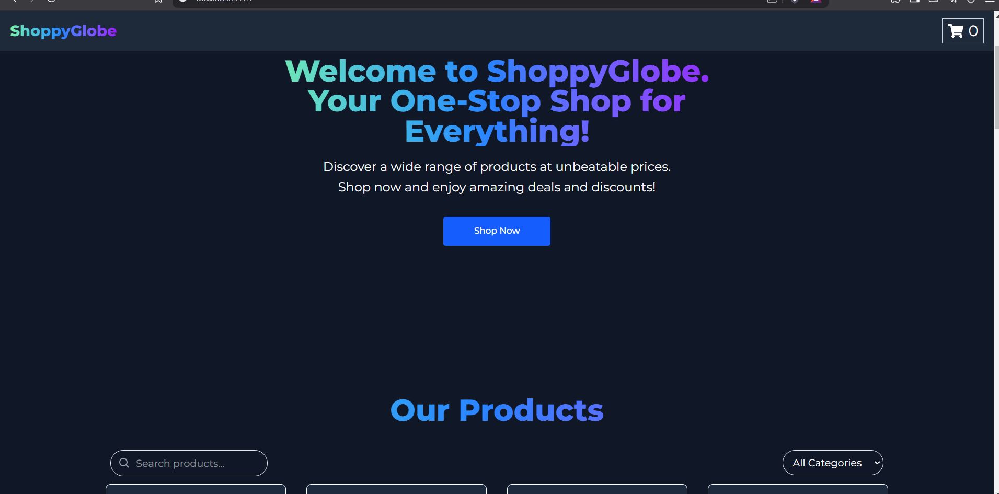

## 📋 To-Do List Application

This is a simple and user-friendly **Online Library** built using **React.js** and **Tailwind CSS**.

## 📸 Application Preview

Here is how the To-Do List Application looks:

💻 Github: [https://github.com/Aditya-Deshmukh9/shoppyGlobe_React](https://github.com/Aditya-Deshmukh9/shoppyGlobe_React)

💻 Deploy: [https://shoppyglobe-aditya.netlify.app/](https://todoappinternshala.netlify.app/)



## 📂 Project Setup

Follow the instructions below to run the project on your local machine.

### 💻 Prerequisites

- Node.js (v18 or higher)
- npm or pnpm
- Vite.js

---

## 🚀 Getting Started

### 1. Clone the Repository

```bash
git clone https://github.com/Aditya-Deshmukh9/shoppyGlobe_React.git
cd To-Do-List-application-React
```

### 2. Install Dependencies

```bash
npm install
```

or

```bash
pnpm install
```

### 3. Run the Application

```bash
npm run dev
```

### 4. Open in Browser

After running the above command, open your browser and visit:

```
http://localhost:5173
```

---

## 🔥 Technologies Used

- **React.js** (with hooks)
- **Tailwind CSS** (for styling)
- **Vite.js** (for fast build)

---

## 🤝 Contributing

Contributions are always welcome!  
If you'd like to add new features, improve the code, or fix any bugs, feel free to fork the repository and submit a pull request.

---

## 📜 License

This project is licensed under the **MIT License**.

---

## 📬 Contact

For any queries or suggestions, feel free to contact me at:  
📧 Email: [your-email@gmail.com](mailto:adityadesh937@gmail.com)  
😊 Portfolio: [aditya_deshmukh](https://adityadeshmukh.online)

💻 GitHub: [AdityaDeshmukh9](https://adityadeshmukh.online/github)

---

🔥 **Happy Coding! 🚀**
